<!-- Animated Wave Header -->
<div align="center">
  
</div>

<!-- Animated Typing -->
<div align="center">
  
[](https://git.io/typing-svg)

</div>

<!-- Social Links & Stats -->
<div align="center">
  
  [](https://www.linkedin.com/in/eugene-pomevor)
  [](mailto:pomevoreugene@gmail.com)
  
  
</div>

<br/>

<!-- Animated Divider -->


##  About Me


```yaml
name: Eugene Kofi
role: DevOps Engineer
location: Accra, Ghana 🌍
education:
  - degree: Bachelor of Education
    university: University of Education, Winneba
    
experience:
  - role: DevOps Engineer
    focus: Cloud Infrastructure & Automation
  - background: Education & Military Service (Ghana Armed Forces)
    
current_focus:
  - Building scalable cloud infrastructures
  - Implementing DevSecOps best practices
  - Containerization & Orchestration
  - Infrastructure as Code (IaC)
  
seeking: Global DevOps/Cloud opportunities with relocation support 🚀
```

<br clear="both">
<!-- Certifications Section -->
## 🏆 Certifications & Achievements

<div align="center">
  <table>
    <tr>
      <td align="center" width="33%">
        <a href="https://www.credly.com/badges/4b1e8e9e-215f-4d6b-a027-1f2b7304ecff/public_url" target="_blank">
          
          <br/><strong>AWS Solutions Architect</strong><br/>Associate
        </a>
      </td>
      <td align="center" width="33%">
        <a href="https://www.credly.com/badges/4a2c3b19-bd68-41c3-961b-465a5b2ed55e/public_url" target="_blank">
          
          <br/><strong>HashiCorp Terraform</strong><br/>Associate (003)
        </a>
      </td>
      <td align="center" width="33%">
        <a href="https://www.credly.com/badges/0fb45ef8-6587-4854-b88c-5b8686cebfbb/public_url" target="_blank">
          
          <br/><strong>Certified Kubernetes</strong><br/>Administrator
        </a>
      </td>
    </tr>
  </table>
</div>


### ☁️ Cloud & Infrastructure
<div align="center">
  
  
  <a href="https://www.terraform.io/certification" target="_blank">
    
  </a>
  
  
</div>


### 🐳 Containerization & Orchestration
<div align="center">
  
  
  
  
  
</div>

### 🔧 CI/CD & Automation
<div align="center">
  
  
  
  
  
  
</div>

### 📊 Monitoring & Observability
<div align="center">
  
  
  
  
  
  
</div>

### 🛠️ Configuration Management & Scripting
<div align="center">
  
  
  
  
  
  
</div>

### 🔐 Version Control & Collaboration
<div align="center">
  
  
  
  
  
</div>

## 🚀 Featured Projects

<div align="center">
  
| Project | Description | Tech Stack | Links |
|---------|-------------|------------|-------|
| **☸️ AWS K8s CI/CD Pipeline** | Automated microservice deployment with GitHub Actions, EKS cluster management, and rolling updates | `EKS` `GitHub Actions` `Helm` `ArgoCD` | [](https://github.com/eugenekofi/microservice-infra-3tier) [](https://github.com/eugenekofi/microservice-infra-3tier) |
| **🛒 E-commerce Microservices** | Kubernetes-based application with service mesh, ingress routing, and full observability stack | `K8s` `Istio` `Prometheus` `Grafana` | [](https://github.com/eugenekofi/microservice-infra-3tier) [](https://github.com/eugenekofi/microservice-infra-3tier) |
| **🔒 DevSecOps React App** | Containerized React application with security scanning, vulnerability assessment, and EC2 deployment | `Docker` `Trivy` `SonarQube` `OWASP` | [](https://github.com/eugenekofi/amazon-devsecops) [](https://github.com/eugenekofi/amazon-devsecops) |

</div>

## 📊 GitHub Analytics

<div align="center">
  
  
</div>

<div align="center">
  
</div>

## 📈 Contribution Graph

<div align="center">
  
</div>

## 🏆 GitHub Trophies

<div align="center">
  
</div>

## ⚡ DevOps Philosophy

```mermaid
graph LR
    A[Plan 📝] --> B[Code 💻]
    B --> C[Build 🔨]
    C --> D[Test 🧪]
    D --> E[Release 📦]
    E --> F[Deploy 🚀]
    F --> G[Operate 🔧]
    G --> H[Monitor 📊]
    H --> A
```

<div align="center">
  


</div>

<div align="center">
  
### 🎯 Core Principles

| Principle | Implementation |
|-----------|----------------|
| **Infrastructure as Code** | Everything is version controlled and reproducible |
| **Automation First** | If you do it twice, automate it |
| **Shift Left Security** | Security integrated at every stage |
| **Continuous Everything** | CI/CD/CM - Never stop improving |
| **Observability** | You can't fix what you can't see |

</div>

## 💭 Daily DevOps Wisdom

<div align="center">
  
[](https://github.com/piyushsuthar/github-readme-quotes)

</div>

## 🤝 Let's Connect & Collaborate

<div align="center">
  
I'm actively seeking **global DevOps/Cloud opportunities** and am open to relocation! 

Feel free to reach out for:
- 🏢 Job Opportunities
- 💡 Open Source Collaboration
- 🎯 DevOps Consulting
- 📚 Knowledge Sharing

<a href="https://www.linkedin.com/in/eugene-pomevor" target="_blank">
  
</a>
<a href="mailto:pomevoreugene@gmail.com">
  
</a>

</div>

<!-- Snake Animation -->
<div align="center">
  
</div>

<!-- Footer Wave -->

